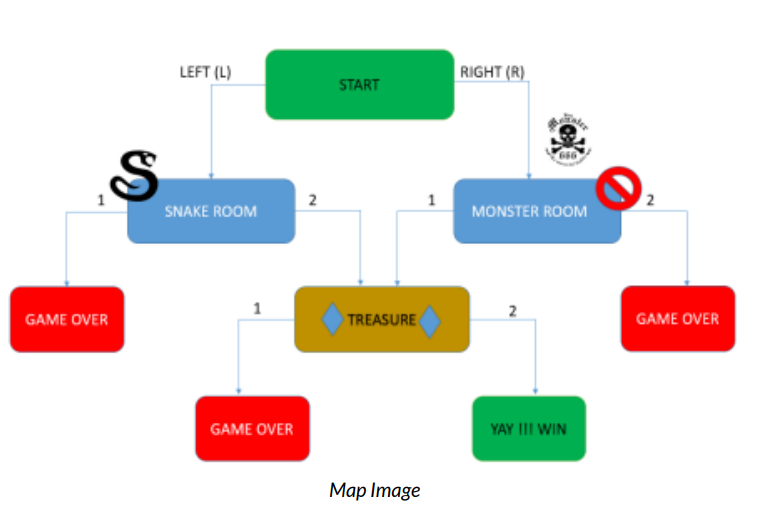

# Treasure Hunt Game 🎮

Welcome to the Treasure Hunt Game! This is a text-based adventure game written in Python 3, designed to teach fundamental programming concepts like functions, conditional logic, and user input handling.

## 📖 Game Overview
In this game, players embark on an adventure to find hidden treasures while avoiding dangers like monsters and traps. The game progresses based on the player's choices.

## 🗺️ How It Works
- Players are presented with a story and prompted to make decisions.
- Each decision leads to a new "room" or ends the game.
- The goal is to find the treasure and win the game.

## 🛠️ Skills You'll Learn
- Using functions in Python.
- Taking user input with `input()`.
- Printing outputs with `print()`.
- Conditional logic with `if`, `elif`, and `else`.
- String manipulation with `.lower()`.

